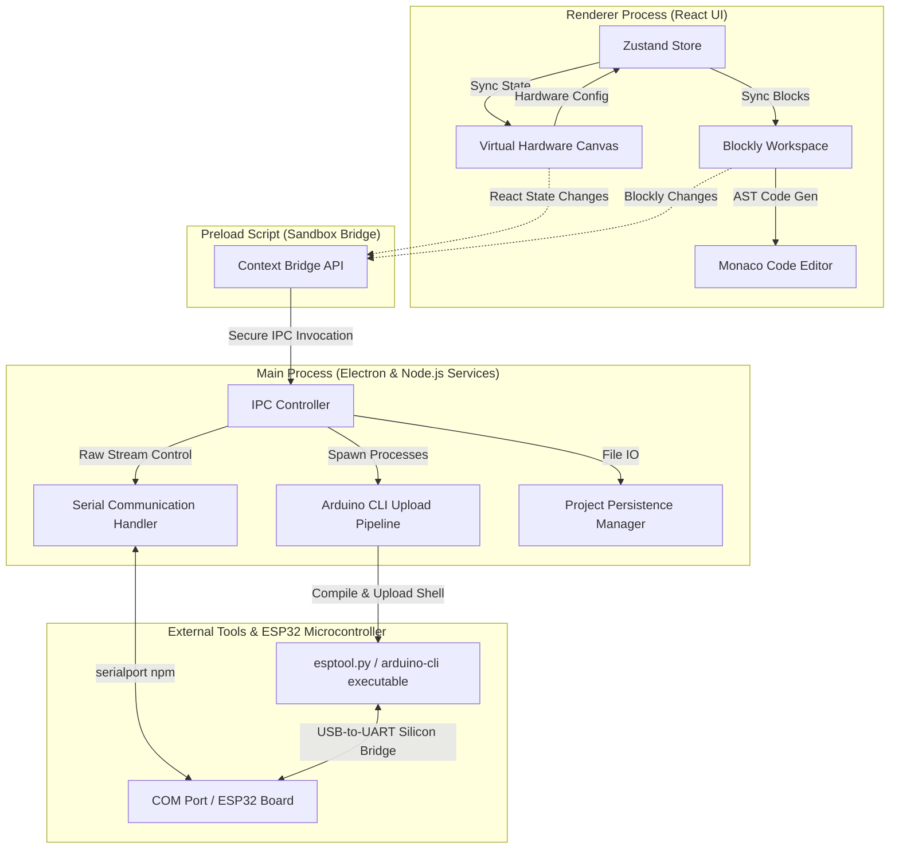
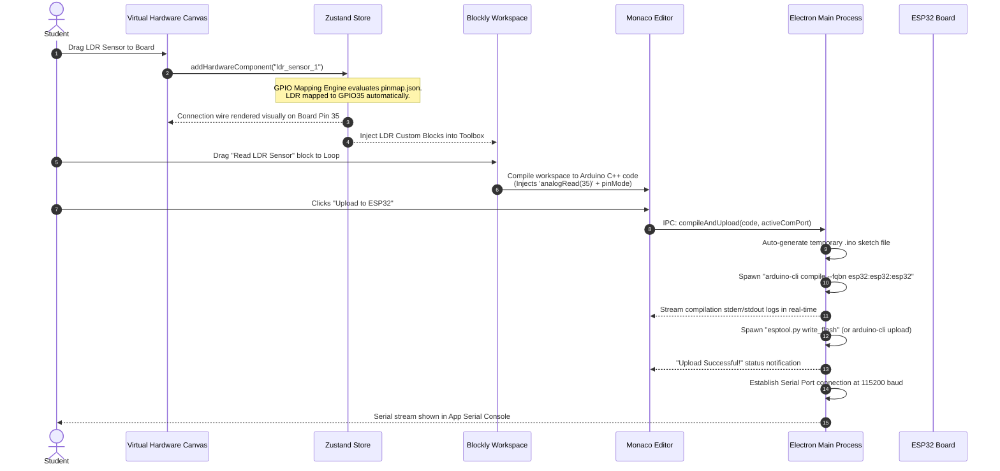
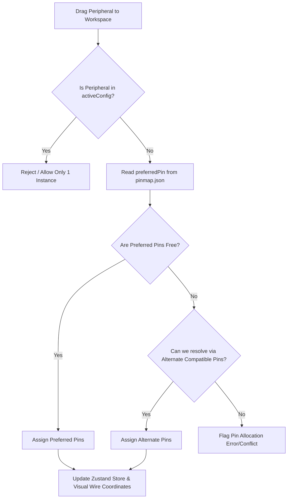
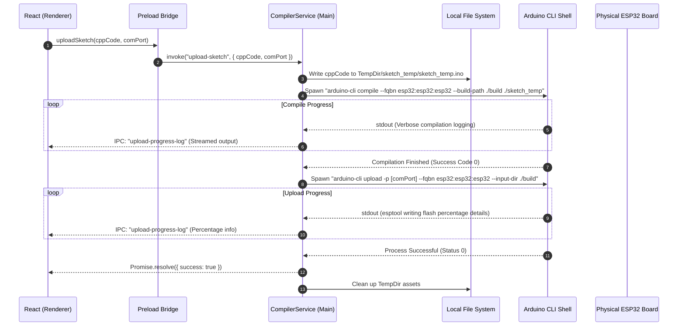

# EduBlocks Studio: Production-Grade Architectural Blueprint & Roadmap

This document serves as the official **Engineering Roadmap and System Architecture Design Specification** for **EduBlocks Studio**—a premium, Scratch-inspired visual programming and physical hardware visualizer desktop application for Windows, tailored for school students using the ESP32 microcontroller platform.

---

## 1. Executive Summary & System Architecture

EduBlocks Studio provides a seamless, zero-config desktop experience that bridges visual programming (Blockly) with real-world physical hardware visual interaction and automatic code generation/compilation/upload pipelines.

### Core Architectural Paradigm
The application uses an **Electron (Multi-Process) + React + TypeScript** model. To maintain high performance and decouple visual updates from hardware interactions, we partition responsibilities clearly:

1. **Renderer Process (React + Tailwind CSS)**:
   - Strictly manages UI states: Blockly Workspace, Virtual Hardware Workspace (Interactive Canvas), Code Preview Editor (Monaco), App Shell, and Serial Terminal UI.
   - Leverages **Zustand** as the single-source-of-truth (SST) reactive state store. State is synchronized down to visual layers and serialized to `.edublock` project files.
2. **Preload Script (`preload.ts`)**:
   - Acts as a secure, sandboxed bridge using `contextBridge` and `ipcRenderer`. No raw Node.js APIs are exposed directly to the React app, ensuring strict desktop security compliance.
3. **Main Process (Electron Core & Node.js System Services)**:
   - Runs local hardware compilation and flashing scripts (spawning `arduino-cli` and `esptool`).
   - Manages OS level operations: reading serial ports (`serialport` library), reading/writing physical project files, detecting COM ports, and handling hardware device plug events.

---

### High-Level System Architecture Diagram



---

### Core Data & State Flow Sequence



---

## 2. Phase-by-Phase Engineering Roadmap

---

### PHASE 1: Project Architecture & Setup

#### 1. Objective
Establish a production-ready, typed, sandboxed, and optimized Electron-React-TypeScript desktop application boilerplate with absolute path mappings, automated hot-reloading for development, state containers, and IPC pipelines.

#### 2. Deliverables
- Fully working Mono-repository configuration with Electron + Vite + React + TypeScript.
- Preconfigured ESLint, Prettier, and TypeScript path mapping rules (`@renderer/*`, `@main/*`, `@shared/*`).
- Solidified IPC schema files.

#### 3. Folder Structure
```
edu-blocks-studio/
├── .eslintrc.json
├── tsconfig.json
├── package.json
├── vite.config.ts
├── src/
│   ├── main/
│   │   ├── index.ts               # Electron main entrypoint
│   │   ├── services/
│   │   │   ├── UploadService.ts    # Interacts with arduino-cli
│   │   │   └── SerialService.ts    # Interacts with serialport npm
│   │   └── preload.ts             # Strict ContextBridge setup
│   ├── shared/
│   │   ├── types/
│   │   │   ├── project.ts         # .edublock schema types
│   │   │   └── ipc.ts             # IPC Channel mapping declarations
│   │   └── constants/
│   │       └── pins.ts            # ESP32 Core Pins Constants
│   └── renderer/
│       ├── index.html
│       ├── main.tsx
│       ├── index.css              # Custom styling definitions
│       ├── src/
│       │   ├── assets/            # SVG vectors for ESP32 and components
│       │   ├── components/        # Visual components
│       │   ├── hooks/             # Custom React Hooks
│       │   ├── store/             # Zustand state management
│       │   └── views/             # Workspace panel views
```

#### 4. Components to Build
- **Renderer Root Wrapper**: Custom Error Boundary surrounding the application root to capture unhandled render crashes.
- **Main Process Orchestrator**: Handles Electron window lifecycle, crash reporting, and standard multi-window security headers (disable remote module, configure CSP headers).

#### 5. Database / Storage Requirements
- No runtime database. Local client settings (e.g. selected COM port, dark mode setting) stored inside `electron-store` as a persistent local configuration file (`config.json`).

#### 6. APIs Required (IPC Interface Specifications)
Create a strongly-typed IPC interface mapping in `src/shared/types/ipc.ts`:
```typescript
export interface IpcApi {
  // Serial
  listPorts: () => Promise<string[]>;
  connectSerial: (port: string, baud: number) => Promise<boolean>;
  disconnectSerial: () => Promise<void>;
  onSerialData: (callback: (data: string) => void) => void;
  // Compile & Upload
  uploadSketch: (code: string, port: string) => Promise<{ success: boolean; log: string }>;
  onUploadProgress: (callback: (progress: string) => void) => void;
  // File IO
  saveProject: (path: string, project: string) => Promise<boolean>;
  openProject: () => Promise<{ path: string; data: string } | null>;
}
```

#### 7. Node Modules Required
```json
"dependencies": {
  "electron-store": "^8.1.0",
  "serialport": "^12.0.0",
  "zustand": "^4.5.2"
},
"devDependencies": {
  "electron": "^29.1.0",
  "electron-builder": "^24.13.3",
  "vite": "^5.1.4",
  "typescript": "^5.3.3",
  "tailwindcss": "^3.4.1"
}
```

#### 8. React Components Required
- `<AppShell />`: Standard CSS Grid/Flexbox three-column editor layout structure (Left: Visual Hardware, Center: Blockly, Right: Monaco Code View & Serial Terminal).

#### 9. Electron Modules Required
- `app`, `BrowserWindow`, `ipcMain`, `dialog`, `safeStorage` (for credential locking if needed later).

#### 10. Blockly Implementation Details
*N/A for Phase 1 (Core setups only).*

#### 11. Code Generation Logic
*N/A for Phase 1.*

#### 12. Testing Strategy
- **Unit Testing**: Run `vitest` to verify initial state machines inside Zustand stores.
- **Integration Testing**: Spin up Electron using `playwright-electron` to check window rendering, CSP validation, and basic preload API bindings.

#### 13. Risks
- **Node C++ Native Addon Compilations**: `serialport` requires binary compilation against Electron's Node version.
- *Mitigation*: Run `electron-rebuild -f -w serialport` immediately post-install.

#### 14. Acceptance Criteria
- App compiles and boots in a sandboxed Electron environment.
- No Node core modules (`fs`, `child_process`) are reachable in Chrome DevTools `window` object.
- CSS styling resets and Tailwind utilities successfully loaded.

---

### PHASE 2: Blockly Workspace

#### 2.1 Objective
Design and implement a highly extensible, Scratch-style Blockly visual coding sandbox container incorporating custom visual themes, responsive canvas sizing, structured toolbox categories, and JSON block schemas.

#### 2.2 Deliverables
- Integrated `<BlocklyWorkspace />` React component.
- Custom XML/JSON-based visual toolbox matching the Scratch styling.
- Core custom block definitions (Setup, Loop, Delay, Pin Modes).

#### 2.3 Folder Structure
```
src/renderer/src/components/blockly/
├── BlocklyWorkspace.tsx           # React mounting container
├── custom-blocks/
│   ├── base.ts                    # Core Setup/Loop blocks
│   ├── sensors.ts                 # Dynamic input sensors blocks
│   └── actuators.ts               # Output motors, OLED, servos
├── generators/
│   ├── arduino.ts                 # Custom Arduino C++ Generator setup
│   └── blocks-generators.ts       # Generator translation files
└── theme/
    └── scratchTheme.ts            # Custom Blockly Theme matching Scratch
```

#### 2.4 Components to Build
- `<BlocklyWorkspace />`: Instantiates, resizes, and teardowns the blockly workspace instance cleanly within the React component lifecycle.
- `<ToolboxContainer />`: Render engine for toolbox categories.

#### 2.5 Database / Storage Requirements
- Workspace state is saved as standard Blockly XML/JSON inside the Zustand store. No database.

#### 2.6 APIs Required
- Local Blockly workspace configuration schemas, window resize tracking hooks.

#### 2.7 Node Modules Required
```json
"dependencies": {
  "blockly": "^10.4.3"
}
```

#### 2.8 React Components Required
- `<BlocklyWorkspace />`: Responsive workspace container that updates on window resize observers (`ResizeObserver`).

#### 2.9 Electron Modules Required
*None (entirely inside Renderer context).*

#### 2.10 Blockly Implementation Details
- A custom block schema in `custom-blocks/base.ts`:
```typescript
import * as Blockly from 'blockly';

Blockly.Blocks['arduino_setup_loop'] = {
  init: function() {
    this.appendDummyInput().appendField("Arduino Setup");
    this.appendStatementInput("SETUP").setCheck(null);
    this.appendDummyInput().appendField("Arduino Loop forever");
    this.appendStatementInput("LOOP").setCheck(null);
    this.setStyle('loop_blocks');
    this.setTooltip("The starting setup and loop functions.");
    this.setHelpUrl("");
  }
};
```
- Custom Scratch-like styling definitions via the Blockly theme object.

#### 2.11 Code Generation Logic
Translate blocks into structural chunks. The base Setup/Loop block defines standard wrappers:
```typescript
import { arduinoGenerator } from './generators/arduino';

arduinoGenerator['arduino_setup_loop'] = function(block: Blockly.Block) {
  const setupCode = arduinoGenerator.statementToCode(block, 'SETUP');
  const loopCode = arduinoGenerator.statementToCode(block, 'LOOP');
  
  // Custom structure to be organized by compiler
  const code = `void setup() {\n${setupCode}}\n\nvoid loop() {\n${loopCode}}\n`;
  return code;
};
```

#### 2.12 Testing Strategy
- Standard block drag-and-drop validation scripts inside Jest/Vitest.
- Visual workspace configuration testing by asserting presence of Blockly svg elements in DOM.

#### 2.13 Risks
- Overlapping block styles causing lag.
- *Mitigation*: Disable standard real-time full DOM updates in visual elements while dragging blocks by utilizing Blockly's native canvas rendering engines.

#### 2.14 Acceptance Criteria
- Students can drag custom setup/loop blocks onto canvas.
- Real-time serialization of blocks to XML/JSON is stored inside the Zustand state.
- Custom categories present with custom visual colors matching Scratch styling guidelines.

---

### PHASE 3: Virtual Hardware Workspace

#### 3.1 Objective
Create a rich, interactive 2D Virtual Hardware Canvas showing the ESP32 development board and visual peripheral items (IR Sensor, LDR, Motors, etc.) that can be drag-dropped, wired up, and visualised in real-time.

#### 3.2 Deliverables
- Premium, SVG-based rendering of the ESP32 target board showing detailed pin breakouts.
- Drag-and-drop Component Palette (IR, LDR, Temp, Motors, Servo, OLED, Touch).
- Dynamic SVG wire routing calculation engine connecting sensors to active GPIOs automatically.

```
Virtual Hardware Workspace Concept
+-------------------------------------------------------------+
|  [Component Palette]       [Hardware Canvas]                |
|  +-----------------+       +-----------------------------+  |
|  |  ( ) IR Sensor  |------>| [IR Sensor Component]       |  |
|  |  ( ) Servo      |   *   |       | (Visual Wire)       |  |
|  |  ( ) OLED       |  * *  |       v                     |  |
|  +-----------------+   *   | [ESP32 Pin 34 (GPIO34)]     |  |
|                        *   | +-------------------------+ |  |
|                        *   | |                         | |  |
|                            | |         [ESP32]         | |  |
+----------------------------+--------------------------------+
```

#### 3.3 Folder Structure
```
src/renderer/src/components/hardware/
├── HardwareWorkspace.tsx          # Canvas parent container
├── PinConnectorEngine.ts          # Computes SVG path routing coordinate nodes
├── components/
│   ├── ESP32Board.tsx             # Main vector rendering of the ESP32 board
│   ├── ComponentPalette.tsx       # Sidebar containing list of sensors
│   ├── VisualWire.tsx             # Interactive SVG curved lines (Bézier curves)
│   └── devices/
│       ├── IRSensorDevice.tsx
│       ├── LDRDevice.tsx
│       └── ServoDevice.tsx
```

#### 3.4 Components to Build
- `<ESP32Board />`: High-fidelity SVG component showing core hardware interface components, onboard LEDs, and pin arrays.
- `<VisualWire />`: Computes and renders standard cubic Bézier curves `d="M x1 y1 C x_mid1 y1, x_mid2 y2, x2 y2"` dynamically from device terminals to ESP32 board terminal contacts.

#### 3.5 Database / Storage Requirements
- Connected devices coordinates and layout definitions stored in Zustand workspace state:
```typescript
interface ConnectedDevice {
  id: string;
  type: 'ir_sensor' | 'ldr' | 'temp' | 'servo' | 'oled' | 'motor';
  mappedPin: number;
  canvasX: number;
  canvasY: number;
}
```

#### 3.6 APIs Required
- Standard browser Drag and Drop APIs, HTML5 Canvas or SVG coordinate transformation mappings.

#### 3.7 Node Modules Required
- `react-use-gesture` or `@dnd-kit/core` (for premium dragging experiences).

#### 3.8 React Components Required
- `<HardwareCanvas />`: SVG layout container.
- `<HardwareDeviceWrapper />`: Frameless draggable element supporting premium micro-interaction animations.

#### 3.9 Electron Modules Required
*None.*

#### 3.10 Blockly Implementation Details
- Dragging hardware dynamically updates the toolbox contents! E.g. dragging LDR into canvas triggers an action in the Zustand store which injects LDR block categories into the Blockly toolbox workspace in real-time.

#### 3.11 Code Generation Logic
*Hardware placement specifies structural global mapping settings accessed directly during Code Gen (Phase 5).*

#### 3.12 Testing Strategy
- Snapshot testing of SVGs.
- Coordinates mapping validation tests: Verify drag event inputs map correctly to standard bounding-box dimensions.

#### 3.13 Risks
- Cluttered canvas rendering with multiple wires overlapping.
- *Mitigation*: Use a clean, routing algorithm that positions visual sensors on the left and right gutters of the canvas, routing parallel tracks.

#### 3.14 Acceptance Criteria
- User can drag IR Sensor onto canvas.
- Wire dynamically connects from LDR device pin out directly to ESP32 Pin 35 (GPIO35).
- Canvas updates are GPU accelerated with smooth drag tracking.

---

### PHASE 4: GPIO Mapping Engine

#### 4.1 Objective
Build a comprehensive GPIO Mapping Engine that reads hardware mappings from a centralized configuration file, assigns incoming peripherals automatically to correct GPIO pins, detects conflicts, and exposes a clean hardware layer API.

#### 4.2 Deliverables
- `pinmap.json` configurations file.
- Automatic pin collision detector and configuration validator.
- Dynamically rendered connection flags showing current allocation matrices.

#### 4.3 Folder Structure
```
src/shared/hardware/
├── pinmap.json                    # Golden config of ESP32 pins
└── HardwareAbstractionLayer.ts    # Verification & assignment logic engines
```

#### 4.4 Components to Build
- `HardwareAbstractionLayer`: Core class library loaded in Renderer context to evaluate hardware state changes.

#### 4.5 Database / Storage Requirements
- Configuration schema read directly from central `pinmap.json` resource.

#### 4.6 APIs Required
- Internal TS libraries mapping out function pins and capacities.

#### 4.7 Node Modules Required
*None.*

#### 4.8 React Components Required
- `<PinMappingInspector />`: Expandable side-drawer showing a table of current pins, their assignments, and collision/sharing statuses.

#### 4.9 Electron Modules Required
*None.*

#### 4.10 Blockly Implementation Details
*Updates toolbox configurations by setting custom variables corresponding to active pins mapped via this mapping layer.*

#### 4.11 Code Generation Logic
#### Core Pin Configuration Definitions (`pinmap.json`)
```json
{
  "board": "ESP32-WROOM-32",
  "pins": {
    "GPIO34": { "name": "GPIO34", "adc": "ADC1", "inputOnly": true, "interfaces": ["ANALOG_IN", "DIGITAL_IN"] },
    "GPIO35": { "name": "GPIO35", "adc": "ADC1", "inputOnly": true, "interfaces": ["ANALOG_IN", "DIGITAL_IN"] },
    "GPIO32": { "name": "GPIO32", "adc": "ADC1", "inputOnly": false, "interfaces": ["ANALOG_IN", "DIGITAL_IN", "DIGITAL_OUT"] },
    "GPIO33": { "name": "GPIO33", "adc": "ADC1", "inputOnly": false, "interfaces": ["ANALOG_IN", "DIGITAL_IN", "DIGITAL_OUT"] },
    "GPIO25": { "name": "GPIO25", "adc": "ADC2", "inputOnly": false, "interfaces": ["ANALOG_IN", "DIGITAL_IN", "DIGITAL_OUT", "DAC"] },
    "GPIO27": { "name": "GPIO27", "adc": "ADC2", "inputOnly": false, "interfaces": ["ANALOG_IN", "DIGITAL_IN", "DIGITAL_OUT", "TOUCH"] },
    "GPIO16": { "name": "GPIO16", "inputOnly": false, "interfaces": ["DIGITAL_IN", "DIGITAL_OUT", "UART_RX2"] },
    "GPIO17": { "name": "GPIO17", "inputOnly": false, "interfaces": ["DIGITAL_IN", "DIGITAL_OUT", "UART_TX2"] },
    "GPIO18": { "name": "GPIO18", "inputOnly": false, "interfaces": ["DIGITAL_IN", "DIGITAL_OUT", "SPI_SCK"] },
    "GPIO19": { "name": "GPIO19", "inputOnly": false, "interfaces": ["DIGITAL_IN", "DIGITAL_OUT", "SPI_MISO"] },
    "GPIO21": { "name": "GPIO21", "inputOnly": false, "interfaces": ["DIGITAL_IN", "DIGITAL_OUT", "I2C_SDA"] },
    "GPIO22": { "name": "GPIO22", "inputOnly": false, "interfaces": ["DIGITAL_IN", "DIGITAL_OUT", "I2C_SCL"] },
    "GPIO23": { "name": "GPIO23", "inputOnly": false, "interfaces": ["DIGITAL_IN", "DIGITAL_OUT", "SPI_MOSI"] },
    "GPIO5":  { "name": "GPIO5",  "inputOnly": false, "interfaces": ["DIGITAL_IN", "DIGITAL_OUT", "SPI_CS"] },
    "GPIO13": { "name": "GPIO13", "inputOnly": false, "interfaces": ["DIGITAL_IN", "DIGITAL_OUT"] }
  },
  "peripherals": {
    "ir_sensor": { "type": "input", "preferredPin": "GPIO34", "compat": ["DIGITAL_IN"] },
    "ldr": { "type": "input", "preferredPin": "GPIO35", "compat": ["ANALOG_IN"] },
    "temp": { "type": "input", "preferredPin": "GPIO32", "compat": ["ANALOG_IN"] },
    "joystick": { "type": "input", "preferredPin": ["GPIO33", "GPIO25"], "compat": ["ANALOG_IN"] },
    "touch": { "type": "input", "preferredPin": "GPIO27", "compat": ["TOUCH"] },
    "oled": { "type": "i2c", "preferredPin": { "sda": "GPIO21", "scl": "GPIO22" } },
    "motor_1": { "type": "motor", "preferredPin": ["GPIO16", "GPIO17", "GPIO18", "GPIO19"] },
    "motor_2": { "type": "motor", "preferredPin": ["GPIO21", "GPIO22", "GPIO23", "GPIO5"] },
    "servo": { "type": "output", "preferredPin": "GPIO13", "compat": ["DIGITAL_OUT"] }
  }
}
```

- When a device is dragged onto the workspace, the mapping engine processes it via the following workflow:



#### 4.12 Testing Strategy
- Unit tests validating auto-connection scenarios.
- Conflict validation tests: Assert that attempting to map LDR and IR sensor to the same single pin outputs a formal error model object.

#### 4.13 Risks
- Pins GPIO21/22 are shared by OLED and Motor 2. If both are active, resource starvation or hardware conflicts will occur.
- *Mitigation*: Build validation alerts within the visual editor UI. Warn students that physical bus sharing is active on those lines.

#### 4.14 Acceptance Criteria
- Adding an IR Sensor auto-assigns it to pin 34.
- An attempt to assign duplicate devices updates status indicators showing clear resource usage overlays.

---

### PHASE 5: Blockly → Arduino Code Generator

#### 5.1 Objective
Implement a robust AST code translation registry, mapping Blockly blocks into functional, clean, compiled Arduino C/C++ target files that respect physical pin configurations assigned via the mapping engine.

#### 5.2 Deliverables
- Extensible C++ generator core framework.
- Standard libraries configuration template maps.
- Real-time output stream to the Monaco Editor.

#### 5.3 Folder Structure
```
src/renderer/src/components/blockly/generators/
├── base_arduino.ts                # Extends blockly's standard JavaScript generator
├── sensor_generators.ts           # Concrete logic translations for LDR, IR, Temp
└── actuator_generators.ts         # Concrete code emitters for Motors, Servo, OLED
```

#### 5.4 Components to Build
- `CodeGenerationEngine`: orchestrator reading active states from Blockly and Zustand.

#### 5.5 Database / Storage Requirements
- Transpiled code is kept in memory. Synchronized cleanly to Monaco editor contents.

#### 5.6 APIs Required
- Native Blockly.Generator APIs.

#### 5.7 Node Modules Required
*None.*

#### 5.8 React Components Required
- `<CodePreviewPanel />`: Mounts the Monaco Editor in split-view mode with syntax highlighting set to `cpp` and read-only attributes active.

#### 5.9 Electron Modules Required
*None.*

#### 5.10 Blockly Implementation Details
- The generator registers dynamic properties mapping code blocks to GPIO structures parsed out of the workspace state:
```typescript
import { arduinoGenerator } from './base_arduino';

arduinoGenerator['read_ldr_sensor'] = function(block: Blockly.Block) {
  // Query active pin configuration mapped inside store
  const activePin = getActivePinForDevice('ldr'); 
  const code = `analogRead(${activePin})`;
  return [code, arduinoGenerator.ORDER_ATOMIC];
};
```

#### 5.11 Code Generation Logic
#### Structural Template Assembly Engine
The code compiler merges setup definitions, structural includes, dynamic global declarations, and standard loops.
```typescript
export function assembleArduinoSketch(blocklyCode: string, hardwareConfig: any): string {
  let includes = new Set<string>();
  let globals = new Set<string>();
  let setups = new Set<string>();

  // Check if devices are connected to inject structural templates
  if (hardwareConfig.devices.some(d => d.type === 'oled')) {
    includes.add("#include <Wire.h>");
    includes.add("#include <Adafruit_GFX.h>");
    includes.add("#include <Adafruit_SSD1306.h>");
    globals.add("Adafruit_SSD1306 display(128, 64, &Wire, -1);");
    setups.add("  display.begin(SSD1306_SWITCHCAPVCC, 0x3C);\n  display.clearDisplay();");
  }

  if (hardwareConfig.devices.some(d => d.type === 'servo')) {
    includes.add("#include <ESP32Servo.h>");
    globals.add("Servo myServo;");
    const pin = hardwareConfig.devices.find(d => d.type === 'servo').mappedPin;
    setups.add(`  myServo.attach(${pin});`);
  }

  // Inject pinModes for standard IOs
  hardwareConfig.devices.forEach(d => {
    if (d.type === 'ir_sensor') {
      setups.add(`  pinMode(${d.mappedPin}, INPUT);`);
    }
  });

  const includesStr = Array.from(includes).join("\n");
  const globalsStr = Array.from(globals).join("\n");
  const setupsStr = Array.from(setups).join("\n");

  return `// Generated by EduBlocks Studio
${includesStr}

${globalsStr}

void setup() {
  Serial.begin(115200);
${setupsStr}
}

void loop() {
  ${blocklyCode}
  delay(10); // Standard scheduler release
}
`;
}
```

#### 5.12 Testing Strategy
- Unit tests: Transpile sample blocks and compare strings using regex formats.
- Complete compilation loop: Verify emitted code compiles cleanly using CLI validation without target microcontrollers attached.

#### 5.13 Risks
- Students creating infinite blocking loops (e.g. infinite wait loops) causing UI and hardware response blocks.
- *Mitigation*: Ensure generator automatically appends non-blocking delays and schedules to limit system locks.

#### 5.14 Acceptance Criteria
- Dragging blocks and connecting them instantly updates the Monaco C++ editor.
- Generated code includes exact libraries and mappings matching active pin sets on the canvas.

---

### PHASE 6: ESP32 Upload Pipeline

#### 6.1 Objective
Design a secure, bulletproof Electron upload pipeline that targets physical microcontrollers, communicates with local `arduino-cli` / `esptool.py` environments, monitors progress metrics, and handles errors robustly.

#### 6.2 Deliverables
- Main process service layer handling shell execution processes.
- Compilation and upload tracking states UI panels.
- Sandboxed CLI executable environment configurations.

#### 6.3 Folder Structure
```
src/main/services/
├── CLIPathManager.ts              # Resolves path directories for local CLI binaries
└── CompilerService.ts             # Spawns compilation commands via node processes
```

#### 6.4 Components to Build
- `CompilerService`: System execution engine running `execa` or child processes to handle toolchain workflows.

#### 6.5 Database / Storage Requirements
- Persistent location configuration variables storing path definitions to custom CLI frameworks.

#### 6.6 APIs Required (IPC Bindings)
- `onUploadProgress`: Real-time streaming log lines from compiler console straight into React state terminal hooks.
- `uploadSketch`: Resolves compiled code objects, mounts temporary directories, writes file systems, and runs pipelines.

#### 6.7 Node Modules Required
```json
"dependencies": {
  "execa": "^8.0.1",
  "fs-extra": "^11.2.0"
}
```

#### 6.8 React Components Required
- `<UploadController />`: Quick action bar with Compile and Upload icons, port selector, and progress overlays.

#### 6.9 Electron Modules Required
- `child_process` (sandboxed inside Main process logic).

#### 6.10 Blockly Implementation Details
*Updates visual compiler elements during state transfers.*

#### 6.11 Code Generation Logic
#### Upload Pipeline Execution Architecture



#### Error Handling Strategy
- In case compile fails: Extract line numbers using regex formats matching `sketch_temp.ino:\d+:\d+: error: ...` patterns.
- Map the target line number back to the respective Blockly Block ID using a map lookup, visually highlighting the failing block with a prominent red outline.

#### 6.12 Testing Strategy
- Mock shell processes inside child-process layers to ensure progress updates parse and bubble up correctly.
- Integration tests targeting physical simulator layers.

#### 6.13 Risks
- Locked or missing target compilers on client computers.
- *Mitigation*: Pack portable, precompiled, standalone packages of `arduino-cli` and basic core libraries inside the Electron release bundle (`extraResources` configuration).

#### 6.14 Acceptance Criteria
- Clicking "Compile" runs compilation tasks and outputs visual completion indicators.
- In case of failure, detailed stack trace reports are streamed into the terminal UI.

---

### PHASE 7: Serial Monitor

#### 7.1 Objective
Construct an optimized, high-frequency, non-blocking serial communication layer interface targeting connected hardware units, processing binary streams, and displaying logs.

#### 7.2 Deliverables
- Serial Port monitoring engine within the main process environment.
- High-frequency console buffer management systems.
- Robust physical connection recovery services.

#### 7.3 Folder Structure
```
src/main/services/
└── SerialService.ts               # Core Serial Connection manager
src/renderer/src/components/serial/
├── SerialConsole.tsx              # Renders visual terminal layouts
└── LogViewer.tsx                  # High-performance scroll list container
```

#### 7.4 Components to Build
- `SerialService`: Tracks active serial ports, opens streams, registers event listeners, and passes data to renderer IPC handlers.

#### 7.5 Database / Storage Requirements
- Persistent user selection storing default Baud configurations (e.g. default: `115200`).

#### 7.6 APIs Required (IPC Bindings)
- `listPorts()`, `connectSerial(port, baud)`, `disconnectSerial()`, `sendSerialData(string)`.

#### 7.7 Node Modules Required
```json
"dependencies": {
  "serialport": "^12.0.0",
  "@types/serialport": "^8.0.8"
}
```

#### 7.8 React Components Required
- `<SerialTerminalPanel />`: Core console grid rendering incoming serial log text efficiently.

#### 7.9 Electron Modules Required
*Native serial connection bindings.*

#### 7.10 Blockly Implementation Details
*N/A.*

#### 7.11 Code Generation Logic
*Enables serial interaction options inside core sketch loop generators.*

#### 7.12 Testing Strategy
- Automated unit scripts listing simulated hardware loop-back devices using virtual ports.
- Test buffering capacity under continuous high-frequency stream conditions.

#### 7.13 Risks
- High-frequency data transfers locking up or slowing down the React main render thread.
- *Mitigation*: Decouple data feeds. Queue incoming logs in the main process and push data updates in batches (e.g., every 50ms) to the Renderer via an IPC throttle.

#### 7.14 Acceptance Criteria
- Connect button detects ESP32 and binds the stream.
- Terminal outputs data matching targeted microcontrollers.

---

### PHASE 8: Project Save / Load System

#### 8.1 Objective
Build a local project management system to structure, validate, and write specialized `.edublock` JSON project blueprints, ensuring complete offline capability.

#### 8.2 Deliverables
- Unified `.edublock` JSON schemas.
- Desktop file-system prompt systems.
- Auto-save engine.

#### 8.3 Folder Structure
```
src/shared/schemas/
└── project.schema.json            # JSON schema validation resource file
src/main/services/
└── PersistenceManager.ts          # Handles reading and writing physical files to disk
```

#### 8.4 Components to Build
- `PersistenceManager`: Standard file-system operations helper running within Electron processes.

#### 8.5 Database / Storage Requirements
- Standard file structures on client disk drives.

#### 8.6 APIs Required (IPC Bindings)
- `saveProject(filePath, data)`, `openProject()`.

#### 8.7 Node Modules Required
- `ajv` (Fast JSON Schema Validator to prevent corrupted project imports).

#### 8.8 React Components Required
- `<MenuActions />`: Save, Save As, and Open menu shortcuts embedded in the app shell header.

#### 8.9 Electron Modules Required
- `dialog` (for native OS file save/open dialogues).

#### 8.10 Blockly Implementation Details
*Supports importing/exporting raw visual configurations.*

#### 8.11 Code Generation Logic
#### Project Persistence Schema (`.edublock` format)
```json
{
  "$schema": "http://json-schema.org/draft-07/schema#",
  "title": "EduBlockStudioProject",
  "type": "object",
  "properties": {
    "version": { "type": "string" },
    "projectName": { "type": "string" },
    "lastSaved": { "type": "string", "format": "date-time" },
    "hardware": {
      "type": "object",
      "properties": {
        "devices": {
          "type": "array",
          "items": {
            "type": "object",
            "properties": {
              "id": { "type": "string" },
              "type": { "type": "string" },
              "mappedPin": { "type": "integer" },
              "canvasX": { "type": "number" },
              "canvasY": { "type": "number" }
            },
            "required": ["id", "type", "mappedPin"]
          }
        }
      },
      "required": ["devices"]
    },
    "workspace": {
      "type": "object",
      "properties": {
        "blocks": { "type": "object" }
      },
      "required": ["blocks"]
    }
  },
  "required": ["version", "projectName", "hardware", "workspace"]
}
```

#### 8.12 Testing Strategy
- Unit tests asserting AJV validation of correct vs corrupted JSON.
- Verify read/write actions using virtual filesystems inside mock test suites.

#### 8.13 Risks
- Outdated file versions failing to open after software updates.
- *Mitigation*: Include strict version properties in settings schemas, feeding assets through translation algorithms before loading them.

#### 8.14 Acceptance Criteria
- Export command writes a valid `.edublock` package file.
- Double-clicking file assets on Windows automatically boots the application and imports configurations.

---

### PHASE 9: UI / UX Polish

#### 9.1 Objective
Deliver a beautiful Scratch-inspired dashboard utilizing harmonious modern visual assets, dynamic CSS interactions, high-contrast layouts, and responsive panels.

#### 9.2 Deliverables
- Sleek, custom-themed UI shell.
- Collapsible side drawers and layout panels.
- Premium sound triggers and micro-interaction animations.

#### 9.3 Folder Structure
```
src/renderer/src/
├── index.css                      # Global styled styling elements
├── views/
│   └── MainDashboard.tsx          # Main high-fidelity screen layout assembly
└── theme/
    └── index.ts                   # Tailwind configuration expansions
```

#### 9.4 Components to Build
- `<ResizablePanel />`: Re-sizable horizontal/vertical panel components allowing custom workspace ratios.
- `<DeviceStatusIndicator />`: Mini visual dashboards displaying memory, CPU status, and connection states.

#### 9.5 Database / Storage Requirements
- Store client window scaling preferences inside `electron-store`.

#### 9.6 APIs Required
*CSS transformations, ResizeObservers.*

#### 9.7 Node Modules Required
- `lucide-react` (high-quality modern icons).

#### 9.8 React Components Required
- `<Header />`, `<Sidebar />`, `<SidebarItem />`.

#### 9.9 Electron Modules Required
*N/A.*

#### 9.10 Blockly Implementation Details
*Applies custom colors and modern styling blocks.*

#### 9.11 Code Generation Logic
*N/A.*

#### 9.12 Testing Strategy
- Manual multi-resolution visual testing.
- Accessibility verification checking contrast profiles.

#### 9.13 Risks
- Blockly rendering loops conflicting with ResizeObservers, causing layout freezes.
- *Mitigation*: Debounce window-resize events when re-calculating core Blockly dimensions.

#### 9.14 Acceptance Criteria
- UI looks polished and professional, featuring premium transitions and hover animations.
- Dark/Light theme switching maps cleanly across all components.

---

### PHASE 10: Packaging & Release

#### 10.1 Objective
Automate build systems using Electron Builder to bundle system binaries, sign applications, and deliver executable installers for school environments.

#### 10.2 Deliverables
- Setup configuration structures mapping output assets.
- Integrated `electron-builder.yml` script.
- Code signing keys infrastructure configuration.

#### 10.3 Folder Structure
```
build/
├── icon.ico                       # Main desktop icon configuration file
├── installerHeader.bmp            # Custom installer background visual
└── electron-builder.yml           # Core deployment configuration
```

#### 10.4 Components to Build
- Build pipeline configurations.

#### 10.5 Database / Storage Requirements
*N/A.*

#### 10.6 APIs Required
- Local updater pipeline endpoints.

#### 10.7 Node Modules Required
```json
"devDependencies": {
  "electron-builder": "^24.13.3"
}
```

#### 10.8 React Components Required
*N/A.*

#### 10.9 Electron Modules Required
- `autoUpdater` (for background deployment updates).

#### 10.10 Blockly Implementation Details
*N/A.*

#### 10.11 Code Generation Logic
*N/A.*

#### 10.12 Testing Strategy
- Run executable installation scripts on multiple clean machines.
- Validate startup signatures to confirm security policies are met.

#### 10.13 Risks
- Anti-virus software false positives blocking the installer in school environments due to missing code signatures.
- *Mitigation*: Sign executables with a valid EV Code Signing Certificate. Offer MSI formats to simplify deployment for school IT administrators.

#### 10.14 Acceptance Criteria
- Compile scripts produce working Windows `.exe` files.
- Executing output installers installs assets to target locations cleanly.

---

## 3. Product Roadmap Visualizer & Execution Strategy

To transition from zero-code to production, we recommend executing the roadmap phases in three parallel work streams:

```mermaid
gantt
    title EduBlocks Studio Development Roadmap
    dateFormat  YYYY-MM-DD
    section Foundation & State
    Phase 1: Project Architecture Setup       :active, p1, 2026-06-01, 7d
    Phase 4: GPIO Mapping Engine Core         :p4, after p1, 5d
    section Visual Editors
    Phase 2: Blockly Workspace Container      :p2, after p1, 10d
    Phase 3: Virtual Hardware Canvas          :p3, after p4, 12d
    section Toolchain & Device IO
    Phase 5: Blockly to Arduino Code Gen      :p5, after p2, 8d
    Phase 6: ESP32 Upload Pipeline (CLI)      :p6, after p5, 12d
    Phase 7: Serial Monitor                   :p7, after p6, 6d
    section Polish & Release
    Phase 8: Project Save/Load persistence     :p8, after p5, 5d
    Phase 9: UI/UX Polish & Dashboards        :p9, after p7, 8d
    Phase 10: Packaging & EV Code Signing     :p10, after p9, 6d
```

---

## 4. Architectural Decision Records (ADRs)

### ADR 001: Automatic Pin Assignment Engine (First-Free Preferred Model)
- **Status**: APPROVED
- **Context**: Students mapping complex peripherals to physical systems can easily get confused by low-level hardware multiplexing details.
- **Decision**: All connections in the Virtual Canvas map dynamically to the single-source-of-truth `pinmap.json` configurations. Peripherals map automatically to their optimal GPIO channels upon connection.
- **Consequence**: Visual wires are automatically drawn correctly, preventing configuration errors before code compilation starts.

### ADR 002: Sandboxed Node Execution via Preload Bridges
- **Status**: APPROVED
- **Context**: The desktop app needs to run local shell binaries (`arduino-cli`) and manage serial systems, but exposing full filesystem APIs to standard React renderers increases security vulnerabilities.
- **Decision**: Preload scripts must isolate IPC execution paths using `contextBridge` mapping objects.
- **Consequence**: Protects the local operating system, allowing safe installation in secured school IT networks.

---

## 5. Future Scalability Strategy

1. **Hardware Expansions**: The mapping engine architecture is board-agnostic. Support for Raspberry Pi Pico or micro:bit can be added by updating `pinmap.json` without modifying the core React application.
2. **Classroom Sync**: The local project serialization format is fully compatible with network storage. Project synchronization can easily be updated to run against remote cloud storage environments.
3. **Web Sandbox Assembly**: The React canvas layers and Blockly layouts are built entirely on open web protocols. The compilation process can easily be redirected from local desktop CLI utilities to remote web compiler infrastructures in the future.
